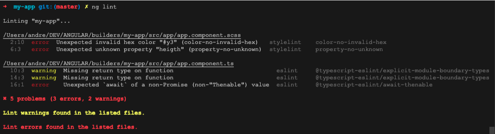

# Angular ESLint + Stylelint Linter

[](https://badge.fury.io/js/@krema%2Fangular-eslint-stylelint-builder)   

An Angular CLI builder inspired by [@angular-eslint/builder](https://github.com/angular-eslint/angular-eslint/tree/master/packages/builder) for linting Angular applications using [ESLint](https://eslint.org/) and [stylelint](https://stylelint.io/) in one easy step.

## Prerequisites

Before using this linter, please ensure that you have already installed and configured **eslint** and **stylelint**, for example, by setting up `.eslintrc` and `.stylelintrc` files. For more information on converting TSLint to ESLint in Angular projects, please check out the [@angular-eslint](https://github.com/angular-eslint/angular-eslint) project.

## Install

`npm install --save-dev @krema/angular-eslint-stylelint-builder`

## Usage

Add the builder `@krema/angular-eslint-stylelint-builder:lint` to the lint task in your *angular.json*.

**angular.json**

> projects &#8594; \<my-project> &#8594; architect &#8594; lint

Replace the builder of `@angular-eslint` with `@krema/angular-eslint-stylelint-builder`:

```diff
 "lint": {
-    "builder": "@angular-eslint/builder:lint",
+    "builder": "@krema/angular-eslint-stylelint-builder:lint",
     "options": {
-        "lintFilePatterns": ["**/*.ts"]
+        "eslintFilePatterns": ["**/*.ts"],
+        "stylelintFilePatterns": ["**/*.scss"]
     }
 }
```

Run `ng lint`:



## Configuration

You can configure the following options:

<table>
  <tr>
    <th>Name</th>
    <th>Default Value</th>
    <th>Description</th>
    <th>Required</th>
    <th>Linter</th>
  </tr>
  <tr>
    <td colspan="5"><b>Basic configuration:</b></td>
  </tr>
  <tr>
    <td>eslintFilePatterns</td>
    <td>[]</td>
    <td>
      One or more files/dirs/globs to pass directly to ESLint&#39;s lintFiles()
      method. i.e. [&quot;src/**/*.ts&quot;]
    </td>
    <td>true</td>
    <td>eslint</td>
  </tr>
  <tr>
    <td>eslintConfig</td>
    <td></td>
    <td>
      Use this configuration, overriding .eslintrc.*config options if present
    </td>
    <td></td>
    <td>eslint</td>
  </tr>
  <tr>
    <td>stylelintFilePatterns</td>
    <td>[]</td>
    <td>
      One or more files/dirs/globs to pass directly to stylelint&#39;s lint()
      method. [&quot;src/**/*.scss&quot;]
    </td>
    <td>true</td>
    <td>stylelint</td>
  </tr>
  <tr>
    <td>stylelintConfig</td>
    <td>&nbsp;</td>
    <td>Path to the stylelint configuration file</td>
    <td></td>
    <td>stylelint</td>
  </tr>
  <tr>
    <td>noEslintrc</td>
    <td>false</td>
    <td>
      Disables use of configuration from .eslintrc.* and package.json files.
    </td>
    <td></td>
    <td>eslint</td>
  </tr>
  <tr>
    <td>fix</td>
    <td>false</td>
    <td>
      Automatically fix, where possible, violations reported by rules (may
      overwrite linted files)
    </td>
    <td></td>
    <td>eslint, stylelint</td>
  </tr>
  <tr>
    <td colspan="5"><b>Cache-related:</b></td>
  </tr>
  <tr>
    <td>eslintCache</td>
    <td>false</td>
    <td>
      Store the results of processed files so that ESLint only operates on the
      changed ones
    </td>
    <td></td>
    <td>eslint</td>
  </tr>
  <tr>
    <td>stylelintCache</td>
    <td>false</td>
    <td>
      Store the results of processed files so that stylelint only operates on
      the changed ones
    </td>
    <td></td>
    <td>stylelint</td>
  </tr>
  <tr>
    <td>eslintCacheLocation</td>
    <td>.eslintcache</td>
    <td>Path to the cache file or directory</td>
    <td></td>
    <td>eslint</td>
  </tr>
  <tr>
    <td>stylelintCacheLocation</td>
    <td>.stylelintcache</td>
    <td>Path to the cache file or directory</td>
    <td></td>
    <td>stylelint</td>
  </tr>
  <tr>
    <td>eslintCacheStrategy</td>
    <td>metadata</td>
    <td>
      Strategy to use for detecting changed files in the cache. Can be either
      metadata or content
    </td>
    <td></td>
    <td>eslint</td>
  </tr>
  <tr>
    <td colspan="5"><b>File Enumeration:</b></td>
  </tr>
  <tr>
    <td>eslintIgnorePatterns</td>
    <td>[]</td>
    <td>
      Array of glob patterns describing files to ignore (replaces <code>eslintIgnorePath</code> and <code>.eslintignore</code> in ESLint 9+)
    </td>
    <td></td>
    <td>eslint</td>
  </tr>
  <tr>
    <td>stylelintIgnorePatterns</td>
    <td>[]</td>
    <td>
      Array of glob patterns describing files to ignore (replaces <code>stylelintIgnorePath</code> and <code>.stylelintignore</code> in Stylelint 16+)
    </td>
    <td></td>
    <td>stylelint</td>
  </tr>
  <tr>
    <td colspan="5"><b>Output:</b></td>
  </tr>
  <tr>
    <td>outputFile</td>
    <td></td>
    <td>File to write report to instead of the console</td>
    <td></td>
    <td>eslint, stylelint</td>
  </tr>
  <tr>
    <td>format</td>
    <td>stylish</td>
    <td>
      The output is formatted by using the
      <a href="https://eslint.org/docs/user-guide/formatters/">
        ESLint Output formatter</a
      >
    </td>
    <td></td>
    <td>eslint, stylelint</td>
  </tr>
  <tr>
    <td>silent</td>
    <td>false</td>
    <td>Hide output text</td>
    <td></td>
    <td>eslint, stylelint</td>
  </tr>
  <tr>
    <td colspan="5"><b>Handling warnings:</b></td>
  </tr>
  <tr>
    <td>quiet</td>
    <td>false</td>
    <td>
      Only register violations for rules with an "error"-level severity (ignore
      "warning"-level)
    </td>
    <td></td>
    <td>eslint, stylelint</td>
  </tr>
  <tr>
    <td>maxWarnings</td>
    <td>-1</td>
    <td>Number of warnings to trigger nonzero exit code</td>
    <td></td>
    <td>eslint, stylelint</td>
  </tr>
  <tr>
    <td>force</td>
    <td>false</td>
    <td>Succeeds even if there was linting errors</td>
    <td></td>
    <td>eslint, stylelint</td>
  </tr>
</table>
